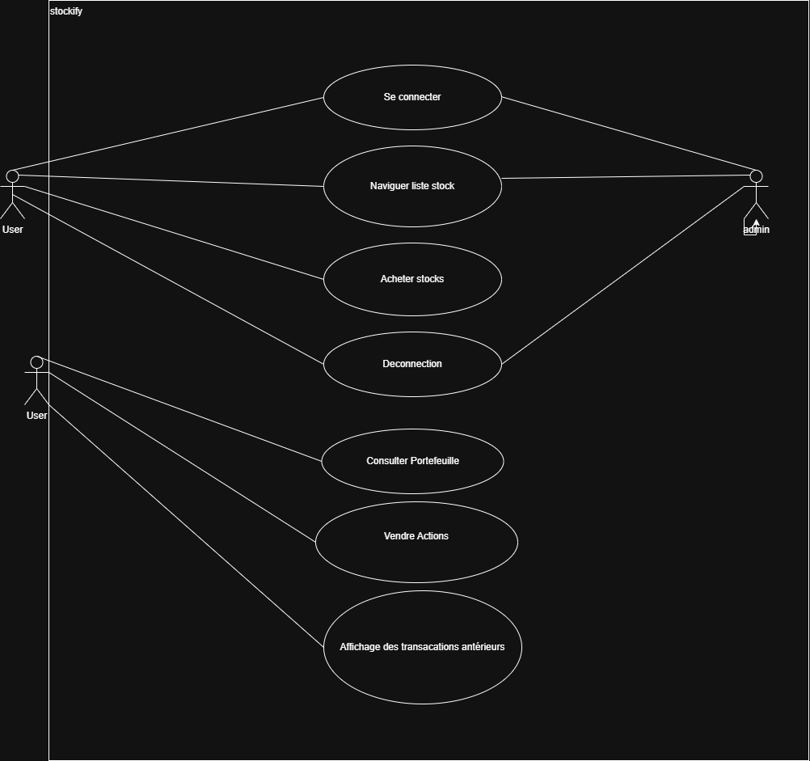
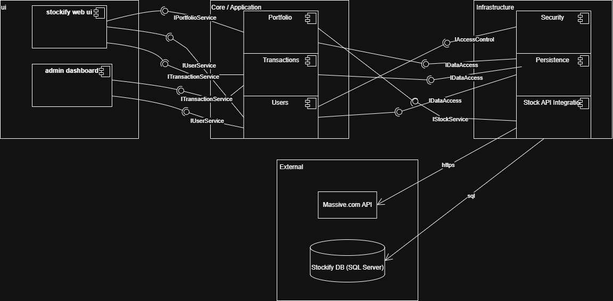
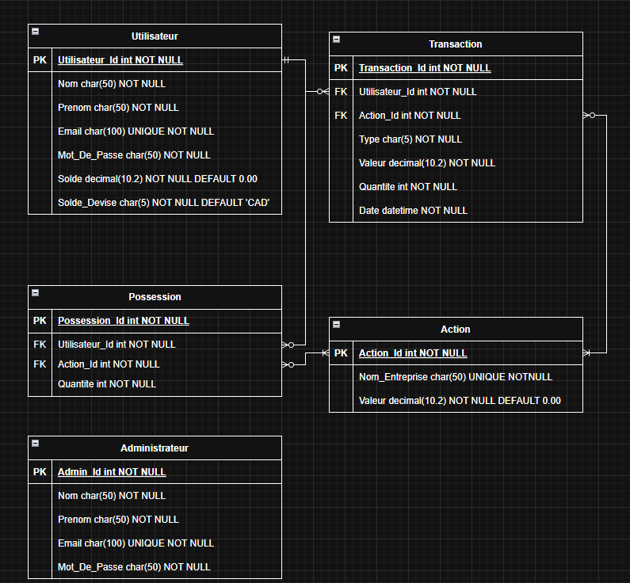

# Rapport Stockify

### Correction apporte suite aux commentaire du livrable 1

Le lien vers le SRS.md dans le README.md a ete corriger et est maintenant fonctionnelle.

### Diagrammes

### Diagramme de classe

Classe user qui represente un utilisateur avec comme attributs ses informations de compte et une liste de stock du type PortfolioItem. PortfolioItem represente une stock que le user possede, cette classe herite de la classe stock. La classe stock represente une stock typique. Classe transactions represente une transaction effectuer par le user vente ou achat d'une stock contenant les infos pertinentes de la transac. La classe admin sera un user qui pour gerer l'application notamment supprimer un user client, d'autres actions seront defini au fur et a mesure. Finalement la class Api manager qui est utilise le patron de conception Singleton qui implemente la classe interface stockService pour utiliser ses methodes.

### Diagramme de Cas d'utilisation
Ce diagramme montre les principales actions possibles dans l’application Stockify. Il y a deux acteurs : l’utilisateur et l’administrateur. Les deux peuvent se connecter, naviguer dans la liste des stocks et se déconnecter. L’utilisateur, lui, peut en plus acheter des stocks, consulter son portefeuille, vendre des actions et voir l’historique de ses transactions.

### Diagramme de composantes

Ce diagramme montre l’architecture de Stockify en couches. L’UI (site web + dashboard admin) appelle les services du Core (Users, Transactions, Portfolio). Le Core utilise l’Infrastructure pour la sécurité, la persistance (BD) et l’intégration des stocks. L’infrastructure communique avec l’API Massive.com (HTTPS) et la base SQL Server.

### Diagramme d'entite relationnelle

Ce diagramme montre l'architecture de la base de donnée. La table Utilisateur contient les informations d'identification des différents utilisateurs ainsi que le solde du compte. La table Action contient les différentes actions existante, de quel entreprise elles sont ainsi que la valeur unitaire de l'action. La table possession entre en relation avec les tables Utilisateur et action pour établir le portefeuille actuel des individus à partir d'un utilisateur, l'action et la quantité de l'action. La table Transaction entre en relation avec les tables Utilisateur et action pour établir l'historique des transaction en concervant l'utilisateur, l'action, le type de transaction, la valeur de la transaction, la quantité d'action ainsi que la date de la transaction. Finalement, la table Administrateur contient les utilisateurs avec des droits d'accès au fonctionnalité restreinte de l'application.

